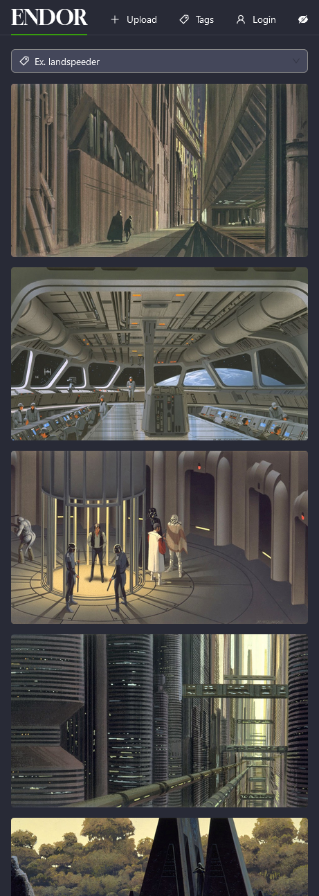
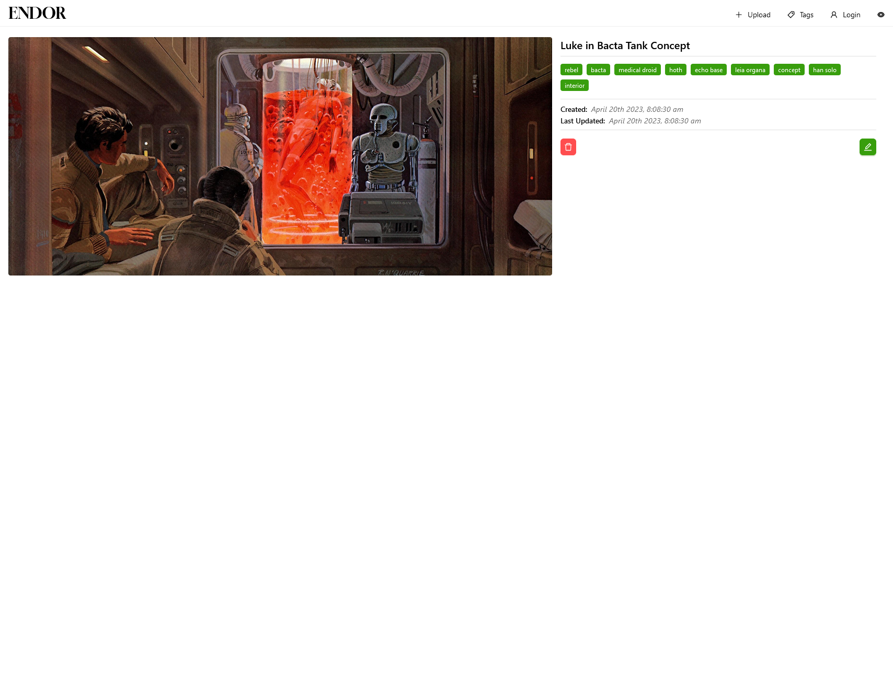
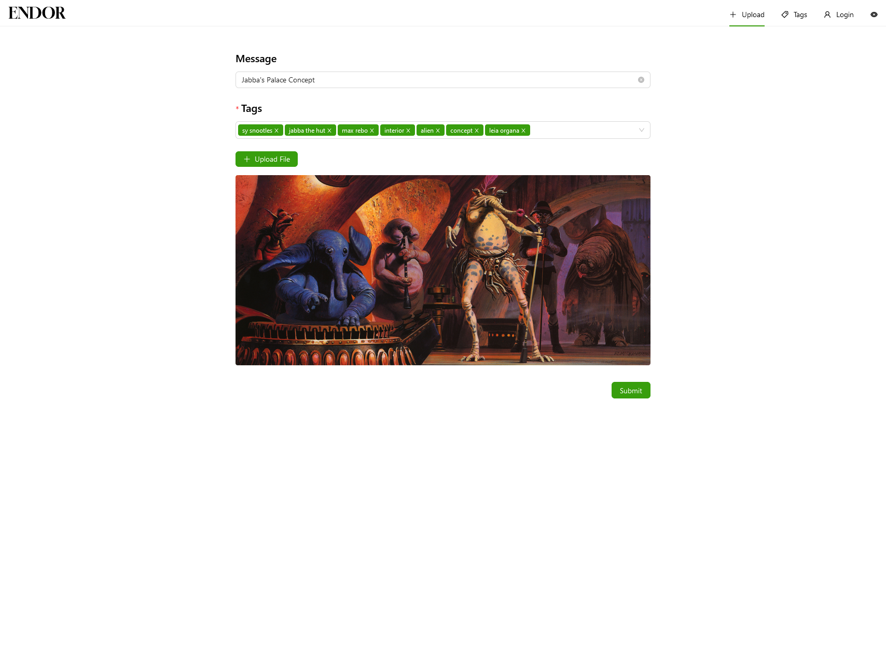

# ENDOR

Explicitly Named and Detailed Object Repository

## What is it?

Endor is an image tagging and viewing application. Inspired by Booru style image boards.

## Why?

There are many Booru viewers, but not Booru style solutions, so we built our own. The main goals were to make something that was fast, relatively lightweight, "minimally" styled and straightforward to use.

Endor is made for applying tags to uploaded images and using tags to build searches. This tagging approach to image metadata makes it fast and simple to find images matching your criteria.

In this case, Endor is being used by the [PSWG](https://github.com/Parzivail-Modding-Team/GalaxiesParzisStarWarsMod) team for reference imagery related to a galaxy far far away.

## Built with

React + Vite

Apollo GraphQL

MongoDB

Digital Ocean Spaces

## Notes

- Fully mobile friendly
- Supports a Light and Dark theme via `theme-ui`
- Tag Editor view for changing tag labels without manually editing the db
- Supports editing and deleting of posts inline from the Post Detail view
- Split via `@loadable/component`
- Image lazy loading in the Home route
- Debounced searching

## Future plans

- [ ] Make Endor a fully deployable application that can be stood up by others for their own purposes with minimal config.

## Images

### Home

### Home (Mobile with dark theme)

### Post detail view

### Upload view

